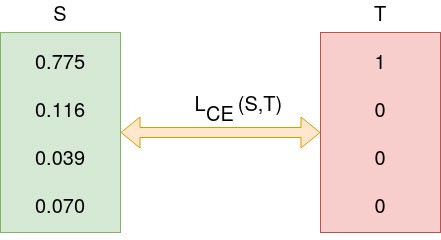

## Problem Statement
Design a neural network that can take inputs as below and can predict the outputs as below:

**Inputs:** an MNIST image and a Random number.

**Outputs:** MNIST Digit and sum of MNIST digit + random number.


To execute our code, run [EVA7_PyTorch.ipynb](EVA7_PyTorch.ipynb) locally or use this [link](https://colab.research.google.com/drive/1zVnbS3jnDvBPmI8Lx1Eo08WYed6o40us?usp=sharing) to directly run on Google Colab.

## Data Representation
We represent the dataset as shown below:

| Image   | Random Number | Label | Sum Label |
| ------- | ------------- | ----- | --------- |
| [28x28] | 3             | 5     | 8         |

## Data Generation
We generated our data using the ``Dataset`` class from ``torch.utils.data``.

```python
class MNISTRandDataset(Dataset):
    def __init__(self, mnist):
        self.mnist = mnist

    def __len__(self):
        return len(self.mnist)

    def __getitem__(self, idx):
        image, label = self.mnist[idx]

        rand_num = random.randint(0, 9)

        rand_num_tensor = F.one_hot(torch.tensor(rand_num), num_classes=10)
        sum_label = label + rand_num

        return image, rand_num_tensor, label, sum_label
```

## Data Input Combination
We have concatenated the final probabilities of 10 classes for a MNIST image from fully connected layer (``self.fc2``) with the Random number represented in 10-bit one hot encoded vector.

After this we get a tensor of size 20, which we pass through final fully connected layer (``self.fc3``) with ``input_features = 20`` and ``output_features = 19``, to get all possible probabilities of sums which are 19 (0 → 18).


Here ``out → MNIST digit`` and ``sum_out → MNIST digit + random number``

## Model Architecture


## Loss Function
We used 2 losses, one for each ouput, and averaged them to get total loss.

The individual losses used were ``Cross Entropy`` loss.

Since this is a classification task where we had to classify numbers for both the outputs, we have used cross entropy loss which is calculated as shown below:





## Evaluation Methodology
We created a test dataset of 10,000 images using the same ``Dataset`` class as train set.

We measured and compared the Total loss on Train set vs Test set and Accuracy on Train set vs Test set.

### Our Results
Below are the results of our model predictions at each epoch. We have trained the model for ``25 epochs`` and all the training was done on **GPU**. The best test accuracy was 85.60 %


#### Loss vs No. of Epochs


#### Accuracy vs No. of Epochs

